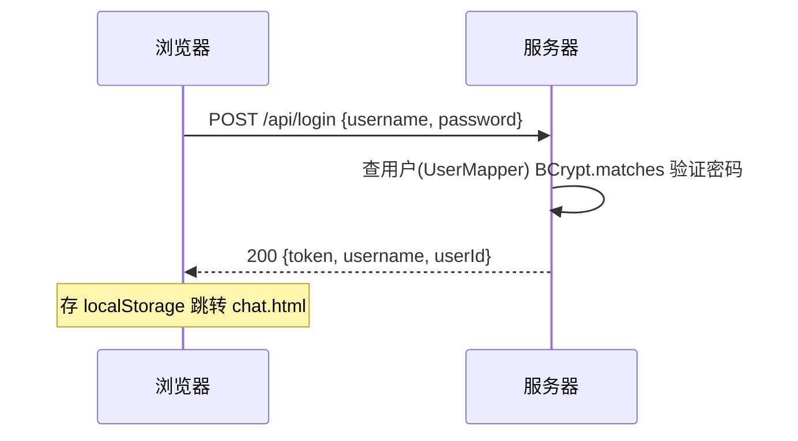
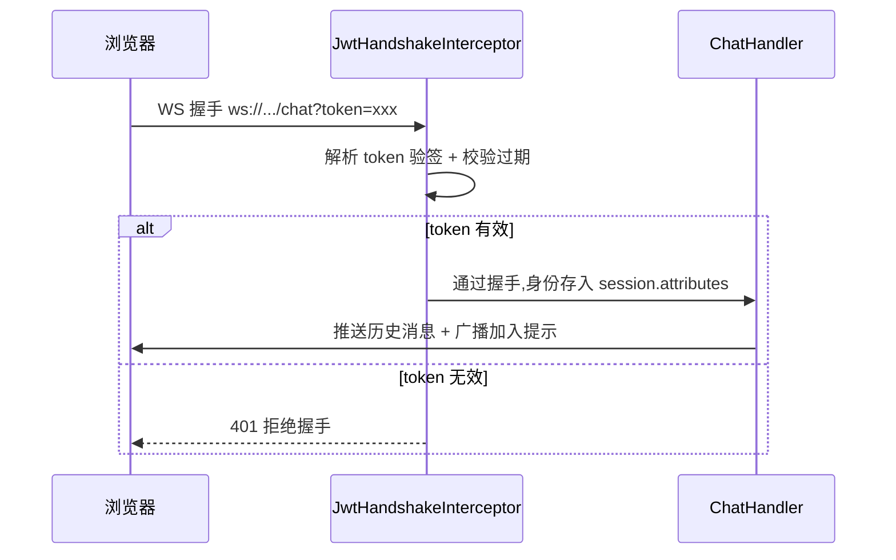

# 实时聊天室 Chat

基于 Spring Boot + WebSocket + MySQL 的多人实时聊天系统。支持多用户实时通信、在线人数显示、历史消息回放。

## 功能特性

- 多人实时聊天,基于 WebSocket 全双工通信
- **基于 JWT 的用户认证**:注册、登录、token 签发、WebSocket 握手鉴权
- **密码 BCrypt 加密存储**(cost=10,自动加盐)
- 实时在线人数显示
- 加入/离开提示
- 消息持久化到 MySQL,新用户加入时自动展示最近 50 条历史
- 消息时间显示(历史显示具体时间,新消息显示当前时间)
- - **私聊功能**:1v1 定向消息,接收者离线时消息入队,重连时自动补推(at-least-once 投递)
- **单端登录**:同账号新窗口登录会踢掉旧连接(旧端收到 kicked 通知 + 跳回登录页)
- **在线用户名单** + **侧栏会话列表**(仿 QQ/微信 UI,点在线用户开私聊)
- **未读消息徽章**:每个私聊会话独立追踪未读数
- **消息按天分组**:历史消息显示"今天 / 昨天 / YYYY-MM-DD"分隔条

## 技术栈

| 层 | 技术 |
|---|---|
| 后端框架 | Spring Boot 3.5.6, Java 17 |
| 实时通信 | spring-boot-starter-websocket |
| 数据持久化 | MyBatis 3.0.3 + MySQL 8.0 |
| 连接池 | HikariCP(Spring Boot 默认) |
| 工具 | Lombok, Jackson(JSR-310 时间序列化) |
| 前端 | 原生 HTML + JavaScript(WebSocket API) |
| 构建 | Maven |
| 版本控制 | Git, Conventional Commits |
| 认证 | JWT (jjwt 0.12.6) + BCrypt (spring-security-crypto) |

## 项目结构

```
src/main/java/com/yuting/chat/
├── ChatApplication.java         # Spring Boot 启动类,注册 MapperScan、ObjectMapper Bean、PasswordEncoder Bean
├── config/
│   ├── WebSocketConfig.java     # WebSocket 配置:注册 ChatHandler 到 /chat
│   └── JwtHandshakeInterceptor.java   # WebSocket 握手拦截器,验签 JWT
├── controller/
│   ├── RegisterController.java  # 注册接口 /api/register
│   └── LoginController.java     # 登录接口 /api/login,签发 JWT
├── service/
│   └── JwtService.java          # JWT 签发与验签封装
│   └── UserRegistry.java        # 全局用户名内存缓存(L1),私聊校验避免每次查 DB
├── handler/
│   └── ChatHandler.java         # WebSocket 消息处理(连接生命周期 + 消息分发)
├── entity/
│   ├── Message.java             # 消息实体,对应 messages 表
│   └── User.java                # 用户实体,对应 users 表
├── mapper/                      # MyBatis Mapper 接口,@MapperScan 扫描后由动态代理生成实现类
│   ├── MessageMapper.java       # 消息表的数据访问
│   └── UserMapper.java          # 用户表的数据访问
└── dto/
    ├── RegisterRequest.java     # 注册请求 DTO
    └── LoginRequest.java        # 登录请求 DTO

src/main/resources/
├── application.properties       # 应用配置:数据库连接、JWT 密钥与过期时间、MyBatis 配置(均通过环境变量传敏感信息)
└── static/
    ├── chat.html                # 前端页面
    ├── login.html               # 登录页
    └── register.html            # 注册页
```

## 认证流程

### 登录阶段



### WebSocket 鉴权阶段



## 消息协议(基于 WebSocket 上的 JSON)

### 客户端 → 服务器

**发送消息**:
```json
{"type": "chat", "content": "你好"}
```

**发送私聊**:
```json
{"type": "private", "to": "小明", "content": "你好"}
```

**请求加载私聊历史**:
```json
{"type": "load_private_history", "with": "小明", "limit": 50}
```

### 服务器 → 客户端

**普通聊天消息**:
```json
{"type": "chat", "username": "小明", "content": "你好"}
```

**系统消息(加入/离开提示)**:
```json
{"type": "system", "content": "小明 加入了聊天室"}
```

**在线人数 + 用户名单**(更新旧版,原来只有 count):
```json
{"type": "online", "users": ["小明", "小红"], "count": 2}
```

**历史消息(仅推给新加入的用户,不广播)**:
```json
{"type": "history", "messages": [{"id": 1, "username": "小明", "content": "你好", "createdAt": "2026-06-04T14:05:29"}]}
```

**私聊消息(定向推送,包含 id 用于客户端幂等去重)**:
```json
{"type": "private", "id": 42, "from": "小明", "content": "你好"}
```

**私聊历史(按需加载,响应 load_private_history)**:
```json
{"type": "private_history", "with": "小明", "messages": [...]}
```

**被踢通知(同账号在其他端登录时,旧端收到)**:
```json
{"type": "kicked", "reason": "您的账号已在其他设备登录"}
```

## 数据库设计

```sql
CREATE DATABASE chat_db CHARACTER SET utf8mb4 COLLATE utf8mb4_unicode_ci;
       
USE chat_db;
                                                                             
-- 用户表
CREATE TABLE users (
    id BIGINT AUTO_INCREMENT PRIMARY KEY,
    username VARCHAR(50) NOT NULL UNIQUE,
    password_hash VARCHAR(60) NOT NULL,
    created_at DATETIME NOT NULL DEFAULT CURRENT_TIMESTAMP
);

-- 消息表(支持群聊 + 私聊)
CREATE TABLE messages (
                          id BIGINT AUTO_INCREMENT PRIMARY KEY,
                          username VARCHAR(50) NOT NULL,               -- 发送者
                          to_username VARCHAR(50) NULL,                -- 接收者(NULL = 群聊,有值 = 私聊)
                          content VARCHAR(1000) NOT NULL,
                          delivered TINYINT(1) NOT NULL DEFAULT 0,     -- 仅私聊使用:0=未推送,1=已推送
                          created_at DATETIME NOT NULL DEFAULT CURRENT_TIMESTAMP
);
```

**关键设计决策**:
- `utf8mb4` 字符集:支持完整 UTF-8 包括 emoji(MySQL 默认的 `utf8` 只支持 3 字节)
- **users.username UNIQUE**:数据库层兜底并发重名,配合 Java 层的"先查再插"检查
- **users.password_hash VARCHAR(60)**:BCrypt 哈希永远 60 字符,精确匹配
- **password_hash 命名**:字段名即文档,明示这里存的是哈希不是明文
[- **messages.username 不引用 users.id**:故意没用外键——历史消息要保留发送人名,即使用户被删]()
- `BIGINT` 而非 `INT`:防御性设计,消息累计量可能很大
[- `TEXT` 而非 `VARCHAR`:消息内容长度不可预测,TEXT 更稳]()
- `DEFAULT CURRENT_TIMESTAMP`:数据库自动填时间,业务代码无需关心
- **`to_username` NULL 编码消息类型**:群聊 = NULL,私聊 = 接收者用户名;一个字段承载两个信息,查询语义清楚
- **`delivered` 仅对私聊有意义**:群聊消息的默认值 0 不参与投递追踪,查询 `WHERE to_username IS NOT NULL AND delivered = 0` 天然隔离
- **不存 sessionId 到 DB**:曾考虑存"消息推送到哪个连接",但 session 是运行时对象,重连即失效,该字段无持久化价值

## 设计亮点

- **消息协议带 type 字段**:扩展性强,新增消息类型不破坏旧客户端(开闭原则)
- **服务器不信任客户端身份**:chat 消息中 username 由服务端从 session 取,不由客户端传入,防止伪造
- **历史消息只单独推给加入者**:别人不需要重看,sendMessage 与 broadcast 分离
- **失败隔离**:广播消息循环中,单个 session 发送失败不影响其他用户
- **构造器注入**:Spring 推荐的 DI 方式,字段 final、依赖显式可见、易于单元测试
- **敏感配置环境变量化**:数据库密码通过 `${DB_PASSWORD}` 占位符传入,不写进配置文件
- **三索引数据结构**:同一 WebSocket session 装饰器同时被 `sessions Set`(全广播)、`sessionMap`(sessionId → 装饰器,框架回调时恢复)、`userSessionMap`(username → 装饰器,私聊定向发送)引用。一份数据,三种访问路径
- **at-least-once + 客户端幂等消费**:私聊崩溃恢复场景下服务端可能重推同一条消息,客户端维护 `seenMessageIds` Set 按 message.id 去重。exactly-once 在分布式系统里理论上做不到,at-least-once + 幂等才是标准解法
- **CAS 语义解决踢连接竞态**:用 `ConcurrentHashMap.remove(key, value)` 的条件删除,让被踢的老 session 在 `afterConnectionClosed` 里通过"值不匹配"识别出"我不是当前 registered 的",避免误广播"XX 离开了聊天室"
- **L1 用户名缓存**:`UserRegistry` 在 `@PostConstruct` 从 DB 全量加载用户名,私聊消息校验时 O(1) 内存查询;新用户注册时同步更新(先 DB 后缓存,DB 是 source of truth)

## 测试

本项目建立了完整的自动化测试体系,当前测试覆盖率约 60-70%(核心业务路径 100% 覆盖),累计 30 个测试用例。

### 测试策略

采用"测试金字塔"分层:

- **单元测试(22 个)**:测试单个类的核心逻辑,依赖用 Mockito mock 掉,毫秒级执行
- **集成测试(8 个)**:测试 Controller 的 HTTP 层,用 MockMvc 模拟真实 HTTP 请求,验证路由、参数绑定、状态码、JSON 序列化等完整链路

目前不做端到端(E2E)测试。

### 技术栈

| 工具 | 用途 |
|---|---|
| JUnit 5 | 测试框架,`@Test`、断言、`@BeforeEach` 生命周期 |
| Mockito | Mock 依赖对象,`when().thenReturn()`、`doAnswer()`(void 方法) |
| Spring MVC Test | `MockMvcBuilders.standaloneSetup` 构建 MockMvc,验证 HTTP 层 |
| JsonPath | 从 JSON 响应中提取字段并断言 |

### 覆盖清单

**JwtService(4 个单元测试)**:
- 签发 token 返回合法 JWT 字符串(header.payload.signature 三段式)
- 签发-解析往返:验证 userId 和 username 正确回填
- 过期 token 解析抛 `ExpiredJwtException`
- 篡改 token 解析抛 `SignatureException`

**LoginController(4 单元 + 4 集成)**:
- 用户不存在 → 401
- 密码错误 → 401
- 登录成功 → 200 + 返回 token / username / userId
- 用户名为空 → 400

**RegisterController(4 单元 + 4 集成)**:
- 用户名为空 → 400
- 密码太短(< 6 位)→ 400
- 用户名已存在 → 400
- 注册成功 → 200 + 返回 id / username

**UserRegistry(3 个单元测试)**:
- init 从 DB 加载全部用户名到缓存
- exists 对不存在的用户返回 false
- register 能增量添加用户到缓存

**ChatHandler.handlePrivate(5 个单元测试,覆盖决策的完整校验链路)**:
- 接收者在线 → insert + push + markDelivered
- 接收者离线 → insert 但不推不 mark(delivered=0 等重连补推)
- 接收者不存在 → sendError,不 insert
- 自发自收 → insert + 立即 markDelivered(不推送)
- 内容超长 → sendError,不 insert

**ChatHandler.sendUndeliveredPrivate(2 个单元测试)**:
- 有未送达消息 → 全部推送 + 全部 markDelivered
- 无未送达消息 → 早 return,不推不 mark

### 设计原则

**1. 只 mock 真正会被调用的依赖**

参数校验类测试不预设 mock 行为,避免 `UnnecessaryStubbingException`。

**2. 精确参数匹配作为隐式验证**

`when(jwtService.generateToken(1L, "小明"))` 而非 `anyLong()` + `anyString()`——如果 Controller 错误使用了其他字段调用 mock,mock 不匹配返回 null,测试自动失败。

**3. 测试不绑定实现细节**

- 断言 token 用 `.isNotEmpty()` 而非 `.value("fake-token-for-test")`,允许未来 Controller 加前缀等改动
- 只断言异常类型,不断言 message 文案(避免第三方库升级导致测试崩溃)

**4. 集成测试用最小启动**

`MockMvcBuilders.standaloneSetup(controller).build()` 而非 `@SpringBootTest`:
- 不启动 Spring 容器,不初始化数据库、MyBatis、WebSocket
- 单个测试启动 < 500ms(对比 `@SpringBootTest` 5+s)
- 手动 new Controller + mock 依赖,配置零依赖

**5. 反射注入内部状态,跳过 setup 副作用**

ChatHandler 的三个私有 map 用 `ReflectionTestUtils.getField` 拿到引用后直接 put mock session,避免调 `afterConnectionEstablished` 触发 `sendHistory` / `broadcastOnlineList` 等副作用干扰验证。测试代码有权破坏封装,生产代码不行。

### 运行测试

```bash
mvn test
```

在 IntelliJ IDEA 中,可以右键 `src/test/java` 目录选择 "Run 'All Tests'"。

## 本地运行

### 环境要求
- JDK 17
- Maven 3.8+
- MySQL 8.0

### 步骤

**1. 安装并启动 MySQL**

Mac 推荐使用 Homebrew:
```bash
brew install mysql@8.0
brew services start mysql@8.0
mysql_secure_installation   # 设置 root 密码
```

**2. 创建数据库与表**

执行:
\`\`\`bash
mysql -u root -p -e "CREATE DATABASE chat_db CHARACTER SET utf8mb4 COLLATE utf8mb4_unicode_ci;"
mysql -u root -p chat_db < src/main/resources/schema.sql
\`\`\`

或者用 IDEA 的 Database 工具直接执行 `src/main/resources/schema.sql`。

详细的表结构和设计决策见上文 [数据库设计](#数据库设计) 段。

**3. 配置**

***3.1 配置数据库密码(通过环境变量)***

`application.properties` 中密码声明为 `${DB_PASSWORD}`,必须通过环境变量传入(不会写进任何文件):

- **IDEA 用户**:Run → Edit Configurations → Environment variables 添加 `DB_PASSWORD=你的密码`
- **命令行**:`DB_PASSWORD=你的密码 mvn spring-boot:run`
- **永久设置**:把 `export DB_PASSWORD=你的密码` 加到 `~/.zprofile` 或 `~/.bashrc`

***3.2 配置 JWT 密钥(通过环境变量)***

`application.properties` 中 JWT 密钥声明为 `${JWT_SECRET}`,必须通过环境变量传入(不会写进任何文件):

- **IDEA 用户**:Run → Edit Configurations → Environment variables 添加 `JWT_SECRET=你的密钥`
- **命令行**:`JWT_SECRET=你的密钥 mvn spring-boot:run`
- **永久设置**:把 `export JWT_SECRET=你的密钥` 加到 `~/.zprofile` 或 `~/.bashrc`

**生成安全密钥**:
```bash
openssl rand -base64 48
```
这会输出一个 64 字符的随机字符串,作为 `JWT_SECRET` 使用。

**为什么至少 32 字符?** HMAC-SHA256 算法要求密钥至少 256 位(32 字节);本项目用 HS512,要求 64 字节。jjwt 库会校验密钥长度,过短会启动时报错。

**4. 启动项目**

```bash
mvn spring-boot:run
```

或在 IDEA 里点 ChatApplication 的运行按钮。

**5. 注册并登录**

访问 `http://localhost:8080/register.html`, 注册两个或多个账号(如:小明 / 小红)。

注册完跳转到登录页登录。**测试多用户**时,**使用一个普通窗 + 一个隐身窗**(`Cmd+Shift+N`)分别登录不同账号——同浏览器同域下 localStorage 共享,后登的会覆盖先登的 token。

## 已知限制 & 后续规划

- [x] **用户系统 + JWT 签发**:支持注册(BCrypt 加密)+ 登录(签发 JWT token)
- [x] **WebSocket 握手鉴权**:HandshakeInterceptor 验签 JWT,身份从客户端自报改为服务端验证
- [ ] **token 刷新机制**:当前 token 24h 过期后需重新登录,未实现 refresh token
- [ ] **token 存储升级**:当前 localStorage,生产应改 httpOnly Cookie 防 XSS
- [ ] 历史消息分页加载(目前固定加载最近 50 条)
- [ ] 多房间支持
- [ ] 消息删除 / 撤回功能
- [x] **私聊功能**:1v1 定向消息 + at-least-once 投递语义 + 客户端幂等消费 + 单端登录踢旧连接 + 未读徽章 + 按需加载历史
- [x] 替换 System.out 为 SLF4J 日志框架
- [ ] 容器化部署(Docker)+ 云端部署(Render / Railway)

## 关键技术决策与踩坑

### 为什么选 MySQL 8.0 而不是 9.x?
- 8.0 是当前企业绝对主流(中国 Java 后端招聘几乎都点名 8.0)
- 9.x 太新,网上资料少、Spring 生态最佳实践基于 8.x 调优

### 为什么选 MyBatis 而不是 Spring Data JPA?
- 国内 Java 后端市场绝对主流是 MyBatis
- 自己写 SQL,对数据库底层理解更深(面试讲 SQL 更有底气)
- 注解风格(@Insert / @Select)简洁,适合中小项目

### 为什么 Spring Boot 4.0.6 降级到 3.5.6?
- `mybatis-spring-boot-starter 3.0.3` 还未适配 Spring Boot 4.x 的新自动配置机制
- 报错:`Property 'sqlSessionFactory' or 'sqlSessionTemplate' are required`
- 教训:**做项目选已验证稳态版本,不要追最新**

### JDBC URL 的 `characterEncoding` 命名空间问题
- 错写为 `utf8mb4`(MySQL 字符集名),应为 `UTF-8`(Java 字符集名)
- 两者表达同一种编码,但分属不同命名空间:**JDBC 参数用 Java 字符集名,SQL CREATE 用 MySQL 字符集名**

### LocalDateTime 序列化坑
- Jackson 默认把 LocalDateTime 输出为数字数组 `[2026,6,4,14,5,29]`
- 解决：在 Spring 管理的 `ObjectMapper` 中注册 `JavaTimeModule`，并关闭 `WRITE_DATES_AS_TIMESTAMPS`
- 关键：ChatHandler 必须使用 Spring 注入的 `ObjectMapper`
- 最终输出：`"2026-06-04T14:05:29"`